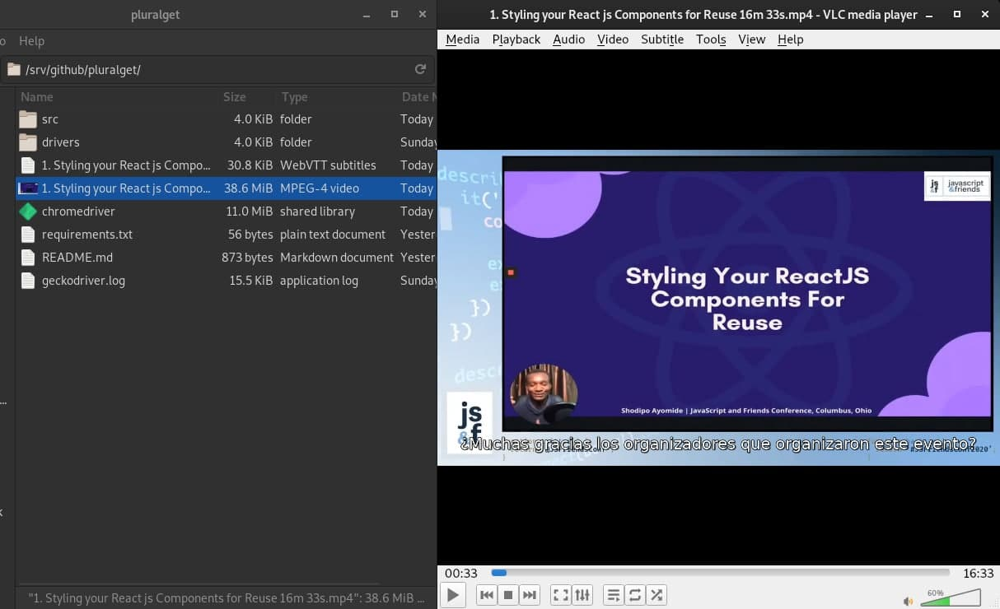

# PluralGet

## Requirements

* Python 3
* Selenium driver

## Installation

pip3 install -r requirements.txt

## Steps
Change the lines from **116** to **119** of the file **src/pluralget.py**
~~~
course = "https://app.pluralsight.com/course-player?clipId=47ae435f-738e-48ca-87d1-7ed9eabfef32"
language = "es"
userName = ""
password = ""
~~~
Caption codes:
~~~
es = Spanish
en = English
...
~~~

# Execution
python3 src/pluralget.py  

# Example

